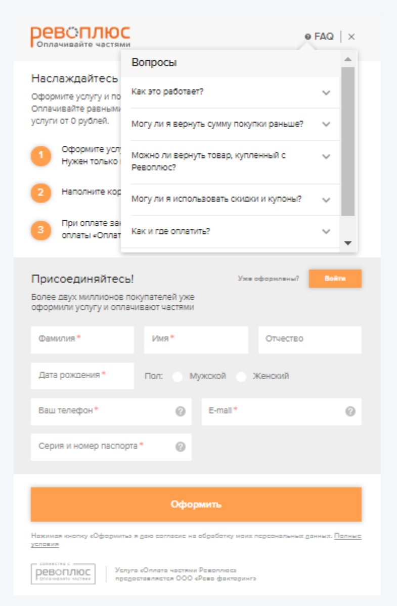
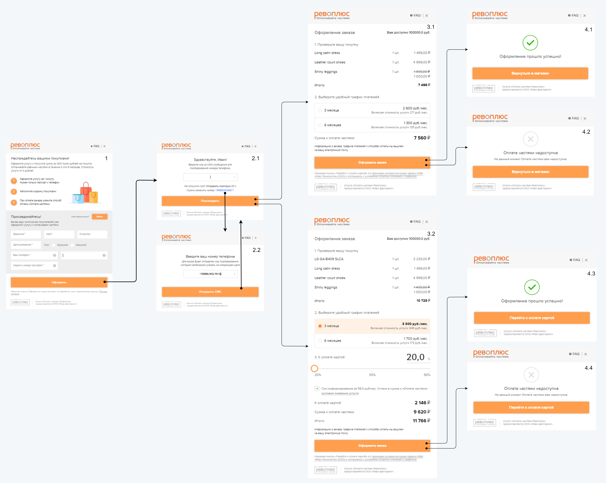
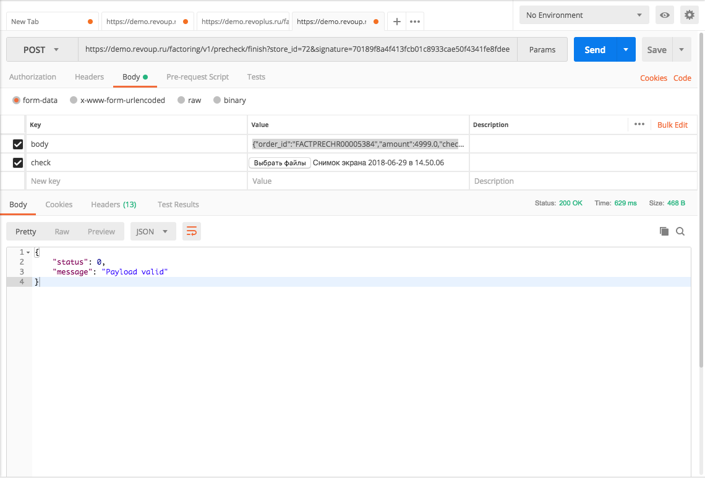

# Введение

API Loans реализовано на протоколе HTTPS на основе JSON запросов.

# Авторизация

## Базовые URL адреса

```javascript
BASE_URL = "https://r.revoplus.ru/"
BASE_URL = "https://demo.revoplus.ru/"
```

1. Для взаимодействия с сервисами Рево используются 2 базовых адреса:
 * https://r.revoplus.ru/ - адрес `production` сервиса.
 * https://demo.revoup.ru/ - адрес `demo` сервиса.
2. `BASE_URL` - переменная обозначающая базовый адрес.

<aside class="notice">
Подключение должно производиться только по протоколу HTTPS  - при попытке подключения по HTTP будет возникать 404 ошибка.
</aside>

## Параметры авторизации

> Пример параметров

```javascript
secret_key = "098f6bcd4621d373cade4e832627b4f6"
STORE_ID1 = 12
STORE_ID2 = 13
```

1. На стороне Рево формируются уникальный идентификатор магазина и секретный ключ, которые передаются партнеру:
 * `store_id` - уникальный идентификатор магазина. Для одного партнера может быть сформировано несколько уникальных идентификаторов, чаще всего, не менее 2. `STORE_ID1` используется для методов `Registration` и `Limit`. `STORE_ID2` - для всех остальных методов.
 * `secret_key` - секретный ключ, который используется при формировании электронно-цифровой подписи для аутентификации (проверки подлинности) параметров запроса с целью защиты формы от запуска сторонними лицами. Длина ключа от 8 байт. Алгоритм шифрования SHA1.
2. Для авторизации партнер отправляет `POST` запрос, используя <a href="#1c37860b3b">цифровую подпись</a> `signature` и уникальный идентификатор магазина `store_id`.
3. Примеры URL запросов можно посмотреть в разделе <a href="#api"> Методы API</a>.

## Принцип формирования цифровой подписи

> Алгоритм формирования цифровой подписи

```ruby--tab
require 'digest/sha1'
secret_key = '9fff8c602b08b00323567be0001480f6'
data = "{\"order_id\": \"FACTPRECHR152632\", \"amount\": \"8300.00\"}"
SIGNATURE = Digest::SHA1.hexdigest(data + secret_key)
```

> Результатом шифрования в примере выше будет являться строка "cbfb21630cd585f59c3a50fc3365d8c26b97cd4e".

```java
import java.io.UnsupportedEncodingException;
import java.security.MessageDigest;
import java.security.NoSuchAlgorithmException;
import java.util.Formatter;

public class Main {

    static String secret_key = "098f6bcd4621d373cade4e832627b4f6"; // Это пример
    static String data = "{\"callback_url\":\"https://shop.ru/revo/decision\",\"redirect_url\":\"https://shop.ru/revo/redirect\",\"current_order\":{\"sum\":\"7500.00\",\"order_id\":\"R001233\"},\"primary_phone\":\"9268180621\"}";

    public static void main(String[] args) {

        String signature = encryptPassword(data + secret_key); // Тут всегда будет 40 символов по SHA1
        System.out.println(signature);
    }

    private static String encryptPassword(String password) {
        String sha1 = "";
        try {
            MessageDigest crypt = MessageDigest.getInstance("SHA-1");
            crypt.reset();
            crypt.update(password.getBytes("UTF-8"));
            sha1 = byteToHex(crypt.digest());
        } catch(NoSuchAlgorithmException e) {
            e.printStackTrace();
        } catch(UnsupportedEncodingException e) {
            e.printStackTrace();
        }
        return sha1;
    }

    private static String byteToHex(final byte[] hash) {
        Formatter formatter = new Formatter();
        for (byte b : hash) {
            formatter.format("%02x", b);
        }
        String result = formatter.toString();
        formatter.close();
        return result;
    }
}
```

К строке `data` в формате json добавляется секретный ключ `secret_key`. К получившейся строке применяется алгоритм SHA1, в результате формируется цифровая подпись `signature`.

<aside class="notice">
Необходимо обратить внимание, что при формировании signature длина всегда будет 40 символов по SHA1.
</aside>

# Методы API

## POST sessions

```ruby
POST BASE_URL/sessions?store_id=STORE_ID1&signature=SIGNATURE
```

Метод для создания сессии пользователя (консультанта). Возвращает токен, который необходим для обращения к другим методам API.

###Parameters

> Пример запроса в формате json

```jsonnet
{
  "user":
  {
    "login": "qwerty",
    "password": "123456"
  }
}
```

| | | |
-:|-:|:-|:-
 |**user**<br> <font color="#939da3">object</font> | <td colspan="2"> Объект, содержащий информацию об авторизуемом пользователе (консультанте).
  <td colspan="2" style="text-align:right">**login**<br> <font color="#939da3">string</font> | | Логин пользователя.
  <td colspan="2" style="text-align:right">**password**<br> <font color="#939da3">sring</font> | | Пароль пользователя.

###Response Parameters

> Пример ответа при успешной аутентификации (code 200).

```jsonnet
{
  "user":
  {
    "authentication_token": "string"
  }
}
```

> Пример ответа при неуспешной аутентификации (code 422).

```jsonnet
{
  "errors":
  {
    "login": ["неверный логин или пароль"]
  }
}
```

| | | |
-:|-:|:-|:-
 |**authentication_token**<br> <font color="#939da3">string</font> | <td colspan="2"> Токен для последующего обращения к методам API.
 |**errors**<br> <font color="#939da3">object</font> | <td colspan="2"> Объект, содержащий информацию об ошибках.
 <td colspan="2" style="text-align:right">**login**<br> <font color="#939da3">string</font> | | Логин пользователя ???

## DELETE sessions

  ```ruby
  DELETE BASE_URL/sessions?store_id=STORE_ID1&signature=SIGNATURE
  ```

  Метод для закрытия сессии пользователя (консультанта).

###Response Parameters

  | | | |
  -:|-:|:-|:-
   |**Code 200** | <td colspan="2"> Операция успешна.
   |**Code 401** | <td colspan="2"> Сессия не обнаружена.

##POST passwords

 ```ruby
 POST BASE_URL/passwords?store_id=STORE_ID1&signature=SIGNATURE
 ```

 Метод для отправки кодя подтверждения пользователю (консультанту).

###Parameters
 > Пример запроса в формате json

 ```jsonnet
 {
   "user":
   {
     "login": "qwerty"
   }
 }
 ```

 | | | |
 -:|-:|:-|:-
  |**user**<br> <font color="#939da3">object</font> | <td colspan="2"> Объект, содержащий информацию об авторизуемом пользователе (консультанте).
   <td colspan="2" style="text-align:right">**login**<br> <font color="#939da3">string</font> | | Логин пользователя.

###Response Parameters

   > Пример ответа при неуспешной аутентификации (code 422).

   ```jsonnet
   {
     "errors":
     {
       "login": ["логин не найден"]
     }
   }
   ```

   | | | |
   -:|-:|:-|:-
    |**authentication_token**<br> <font color="#939da3">string</font> | <td colspan="2"> Токен для последующего обращения к методам API.
    |**errors**<br> <font color="#939da3">object</font> | <td colspan="2"> Объект, содержащий информацию об ошибках.
    <td colspan="2" style="text-align:right">**login**<br> <font color="#939da3">string</font> | | Логин пользователя ???

## PUT passwords

  ```ruby
  PUT BASE_URL/passwords?store_id=STORE_ID1&signature=SIGNATURE
  ```
  Метод для проверки кода подтверждения, установки нового ПИН-а и получения `api_key`.

### Parameters

  > Пример запроса в формате json

  ```jsonnet
  {
    "user":
    {
      "login": "string",
      "confirmation_code": "string",
      "password": "string",
      "password_confirmation": "string"
    }
  }
  ```

  | | | |
  -:|-:|:-|:-
   |**user**<br> <font color="#939da3">object</font> | <td colspan="2"> Объект, содержащий информацию об авторизуемом пользователе (консультанте).
    <td colspan="2" style="text-align:right">**login**<br> <font color="#939da3">string</font> | | Логин пользователя.
    <td colspan="2" style="text-align:right">**confirmation_code**<br> <font color="#939da3">string</font> | | Код подтверждения.
    <td colspan="2" style="text-align:right">**password**<br> <font color="#939da3">sring</font> | | Пароль пользователя.
    <td colspan="2" style="text-align:right">**password_confirmation**<br> <font color="#939da3">string</font> | | Пароль подтверждения.

###Response Parameters

  > Пример ответа при успешной аутентификации (code 200).

  ```jsonnet
  {
    "user":
    {
      "authentication_token": "string"
    }
  }
  ```

  > Пример ответа при неуспешной аутентификации (code 422).

  ```jsonnet
  {
    "errors":
    {
      "confirmation_code": ["неверный"],
      "password": ["должен быть равен 4 символам"]
    }
  }
  ```

  | | | |
  -:|-:|:-|:-
  <td colspan="2" style="text-align:right">**confirmation_code**<br> <font color="#939da3">string</font> | | Код подтверждения.
  <td colspan="2" style="text-align:right">**password**<br> <font color="#939da3">sring</font> | | Пароль пользователя.

## POST loan_requests
## GET loan_requests/{token}
## PUT loan_requests/{token}
## GET loan_requests/{token}/client
## POST loan_requests/{token}/client
## PATCH loan_requests/{token}/client
## POST loan_requests/{token}/confirmation
## POST loan_requests/{token}/client/confirmation
## POST loan_requests/{token}/loan
## POST loan_requests/{token}/loan/finalization
## GET loan_requests/{token}/documents/{kind}

# Коды ошибок

Код | Сообщение | Комментарии
-:|:-|:-
**0** | Payload valid | Всё ок.
**10** | JSON decode error | Некорректный json запрос.
**20** | Order `order_id` missing | Не указан `order_id`.
**21** | Wrong order `order_id` format | Неверный формат `order_id`.
**22** | Order exists | Заявка с данным `order_id` уже существует и финалзирована.
**23** | Order expired | У заявки с данным `order_id` уже истёк холдирования.
**24** | Order with specified id not found | Заявка с указанным `order_id` не найден.
**30** | Wrong order `order_sum` format | Нверный формат `order_sum`.
**32** | Order amount is different from the amount specified before | Указанная при финализации сумма заказа отличается от суммы, на которую совершен заказ. Финализация не осуществлена.
**33** | Order amount is outside of tariff_limits | Сумма заявки не входит в диапазон, установленный в тарифе партнёра. Заявка не создана.
**35** | Order prepayment amount is wrong | Величина `prepayment_amount` превосходит `amount`.
**40** | Order `callback_url` missing | Не указан `callback_url`.
**41** | Order `redirect_url` missing | Не указан `redirect_url`.
**50** | Store id is missing | Не указан `store_id`.
**51** | Store not found | Не найден магазин с идентификтором `store_id`.
**60** | `Signature` missing | Не указана цифровая подпись `signature`.
**61** | `Signature` wrong | Указанная цифровая подпись `signature` некорректна.
**62** | Error saving file | Ошибка при сохранении файла.
**70** | Phone number is different | Номер телефона отличается от указанного в заявке.
**71** | Client has not enough limit | У клиента недостаточно средств для осуществления оплаты частями заказа.
**80** | Unable to finish - order is already finished/canceled | Не удаётся финализировать заявку - заявка с указанным `order_id` уже финализирована или отменена.
**81** | Unable to cancel - order is already finished/canceled | Не удаётся отменить заявку - заявка с указанным `order_id` уже финализирована или отменена.
**82** | Unable to change - order is already finished/canceled | Не удаётся изменить заявку - заявка с указанным `order_id` уже финализирована или отменена.
**90** | Cart items are missing | Не удаётся изменить заявку - не передана информация о корзине.
**100** | At the moment the server cannot process your request | Во всех остальных случаях.

Тестирование и отладка

Тестирование и отладка интеграции производятся на demo сервере (https://demo.revoplus.ru). При заполнении номера телефона в анкете рекомендуется использовать несуществующий префикс оператора 888, чтобы sms сообщения не отправлялись реальным людям. На production сервере использовать такой префикс нельзя.

Все коды подтверждения и пин-коды `8888`.

* Для получения отказ при использовании <a href="#Registration">`Registration`</a> необходимо указать телефон, начинающийся с 88821.

* Для получения одобрения при использовании <a href="#Registration">`Registration`</a> необходимо указать телефон, начинающийся с 888, кроме 88821.

* Для тестирования на production сервере код задаётся в настройках магазина партнёра. Например, это может быть 7777, вместо 8888.

* В анкете идет проверка по ФИО + дате рождения или номеру паспорта на совпадение с существующим клиентом, поэтому при тестировании необходимо вводить различные данные в эти поля.

# Описание iFrame REVO

## Регистрация клиента

><a href="Registration.png" target="new"> </a>

1-2. Заполнение анкеты.<br>
3. Переход на экран подтверждения номера телефона кодом из смс-сообщения.<br>
3.1 Если клиент допустил ошибку при вводе телефона, то возможен переход на шаг с вводом номера телефона. <br>
4.1 После ввода корректного смс кода происходит отображение окна с результатом "Оформление прошло успешно" и информацией о доступном лимите.<br>
4.2 Либо отображение окна с результатом "К сожалению, 'Оплата частями' Вам недоступна".<br>

При вызове iframe Рево на первом экране (1) отображены поля для ввода персональных данных:

  * Фамилия
  * Имя
  * Отчество
  * Дата Рождения
  * Номер мобильного телефона
  * Email
  * Серия и Номер паспорта

Валидация:

  *  Фимилия, Имя, Отвество - принимаются данные только в кириллице. Тип данных `string`.
  *  Дата рождения - задаётся в формате `dd.mm.yyyy`, тип данных `date`.
  *  Номер мобильного телефона - необходимо вводить в 10-значном формате, например (888)1231212. Тип данных `string`.
  *  Email - поле для ввода email, тип данных `string`.
  *  Серия и номер паспорта - длина должна быть ровно 10 символов, тип данных `string`.

<aside class="notice">
При вызове iframe формы поддерживается возможность автозаполнения полей через тело json запроса.
</aside>

## Авторизация клиента

><a href="Authentication.png" target="new"> </a>

1. Нажатие кнопки Войти на первой странице формы. <br>
2.1 Ввод мобильного номера и Нажатие кнопки "Отправить СМС". <br>
2.1 Если мобильный номер не существует в базе Рево, клиент переходит на окно с информационным сообщением "С указанным номером телефона мы Вас не нашли". Нажатие на кнопку "Оформить за 1 минуту" приводит к переход на первый шаг формы. <br>
3.1 Если мобильный номер существует в базе Рево, клиент переходит на экран Подтверждение мобильного номера кодом из смс-сообщения. <br>
3.2 Если клиент допустил ошибку при вводе телефона, то возможен переход на шаг с вводом номера телефона. <br>
4.1 После ввода корректного смс кода происходит отображение окна результата с информацией "Оформление прошло успешно" и информацией о доступном лимите. <br>
4.2 Либо отображение окна результата с информацией "К сожалению, 'Оплата частями' Вам недоступна". <br>

<!-- ><a href="FAQ.png" target="new"> </a> -->

По нажатию на кнопку FAQ в правом верхнем углу формы открывается список с ответами на часто задаваемые вопросы.

<aside class="notice">
При авторизации клиента создаётся 30-минутная сессия, в течении которой при повторных обращениях клиенту сразу открывается финальный экран любой формы.
</aside>

<aside class="notice">
Если клиент не завершил оформление в форме по истечении 'valid_till', то будет выдано сообщение об ошибке "К сожалению, время резервирования заказа вышло.".
</aside>

## Оформление покупки

><a href="Checkout.png" target="new"> </a>

1. Заполнение анкеты. <br>
2.1 Переход на экран подтверждения номера телефона кодом из смс-сообщения.<br>
2.2 Если клиент допустил ошибку при вводе телефона, то возможен переход на шаг с вводом номера телефона. <br>
3.1 Если для оформления заказа не требуется предоплата, то идёт переход на экран, где клиенту необходимо выбрать один из возможных для данной суммы заказа периодов оплаты. <br>
3.1 Если для оформления заказа клиенту необходимо внести предоплату, то идёт переход на экран, где клиенту необходимо выбрать один из возможных для данной суммы заказа периодов оплаты, а также указать желаемую величину предоплаты. <br>
4.1 После успешного оформления заказа без предоплаты происходит отображение окна результата с информацией "Оформление прошло успешно" и кнопкой для возврата в магазин. <br>
4.2 Либо отображение окна результата с информацией "К сожалению, 'Оплата частями' Вам недоступна". <br>
4.3 После успешного оформления заказа с предоплатой происходит отображение окна результата с инфомрмацией "Оформление прошло успешно" и кнопкой для перехода к оплате картой. <br>
4.4 Либо отображение окна результата с информацией "К сожалению, 'Оплата частями' Вам недоступна". <br>

# Представление на сайте

Рекомендации по представлению услуги Оплата частями на партёнрском сайте представлены в <a href="REVO Presentation.pdf" target="new">презентации</a>. Ниже приведены инструкции по реализации отдельных элементов Рево из презентации.

## Вызов iFrame

```javascript
REVO.Form.show(iframe_url, target_selector);
```

По нажатию на кнопки "Оформить за 1 минуту", "?" справа от надписи "или 150 Р/мес" и "Оплата" при выбранном способе "Оплата частями" необходимо вызвать iFrame Рево для регистрации и оформления заказа, соответственно. Для этого нужно получить с помощью метода <a href="#Registration">`Registration`</a> или <a href="#Checkout">`Checkout`</a> ссылку на iFrame и передать её в js метод плагина REVO.

`iframe_url` – адрес открываемого iFrame, обязательный параметр.
`target_selector` – селектор элемента, внутрь которого должен быть вставлен iFrame.

Далее работает предоставленный Рево плагин js (реализован в виде модуля REVO), который вставляет ``<iframe src= iframe_url />`` и производит манипуляции с этим iFrame.

Плагин доступен по адресу: `https://{BASE_URI}/javascripts/iframe/v2/revoiframe.js` и его можно добавить на страницу интернет магазина.

```html
<script src="https://{BASE_URI}/javascripts/iframe/v2/revoiframe.js"></script>
```

Также данный плагин предоставляет возможность получения событий: закрытия формы - `onClose`, загрузки формы - `onLoad` и принятия решения по заявке - `onResult`.

```javascript
REVO.Form.onClose(function () { alert('closed'); });
REVO.Form.onLoad(function () { console.log('frame loaded'); });
REVO.Form.onResult(function() { console.log('result'); });
```
<aside class="success">
При необходимости отобразить iFrame на отдельной странице следует напрямую открывать `iframe_url`. Настройка фона этой страницы производится на стороне Рево.
</aside>

## Отображение доступного лимита

Если клиент уже прошёл регистрацию и получил лимит, то доступные ему для Оплаты частями средства можно отображать с помощью метода <a href="#limit">Limit</a>.

# Тестирование и отладка

## Тестовые Параметры

Тестовые мобильные номера для ввода в <a href="#iframe-revo">iframe</a>:

`8881ХХХХXX` - одобрено всё (второе оформление = повторная заявка)

`88821ХХХХХ` - отказано полностью

`88822ХХХХХ` - одобрены только займ

Код для подтверждения номера телефона - `8888`

<aside class="notice">
Данные параметры предназначены только для demo сервиса.
</aside>


## Кейсы для тестирования

### Подробное описание вызова формы для регистрации клиента.

> Пример формирования signature на ruby:

```ruby--tab
data = {
"callback_url": "https://shop.ru/revo/decision",
"redirect_url": "https://shop.ru/revo/redirect",
"primary_phone": "9268180621",
"primary_email": "ivan@gmail.com",
"current_order":
{
 "order_id": "R001233"
}}
 => {:callback_url=>"https://shop.ru/revo/decision", :redirect_url=>"https://shop.ru/revo/redirect", :primary_phone=>"9268180621", :primary_email=>"ivan@gmail.com", :current_order=>{:order_id=>"R001233"}}

 data = data.to_json
 => "{\"callback_url\":\"https://shop.ru/revo/decision\",\"redirect_url\":\"https://shop.ru/revo/redirect\",\"primary_phone\":\"9268180621\",\"primary_email\":\"ivan@gmail.com\",\"current_order\":{\"order_id\":\"R001233\"}}"

 secret_key = "9fff8c602b08b00323567be0001480f6"

 signature = Digest::SHA1.hexdigest(secret_key + data)
 => "347e8cff27d30b5200c8b32def4365ebbf4270d0"

puts data
{"callback_url":"https://shop.ru/revo/decision","redirect_url":"https://shop.ru/revo/redirect","primary_phone":"9268180621","primary_email":"ivan@gmail.com","current_order":{"order_id":"R001233"}}

```

Для вызова формы используется метод <a href="#registration">registration</a>.

> Пример отправки запроса через API CLIENT:

><a href="rest_client.png" target="new"> </a>

 Необходимые параметры для вызова формы:

* базовый URL сервиса для тестирования и отладки
* store_id
* signature

Описание формирования запроса на получение ссылки вызова iframe:

* В переменную `data` вводится тело json запроса
* Переводим `data` в `json` формат
* В переменную `secret_key` вводим наименование ключа
* В переменную `signature` формируем подпись
* Выводим тело `json` запроса через команду `puts` для отправки запроса через клиент

Данные для отправки запроса в REST CLIENT:

Используется POST URL:
`https://demo.revoup.ru/factoring/v1/limit/auth?store_id=72&signature=347e8cff27d30b5200c8b32def4365ebbf4270d0`

Тело JSON:
`{"callback_url":"https://shop.ru/revo/decision","redirect_url":"https://shop.ru/revo/redirect","primary_phone":"9268180621","primary_email":"ivan@gmail.com","current_order":{"order_id":"R001233"}}`


### Подробное описание отправки запроса на финализацию заказа

> Пример формирования signature на ruby:

```ruby--tab
data = {order_id: "FACTPRECHR00005384", amount: 4999.0, check_number: "sdfhk"}
 => {:order_id=>"FACTPRECHR00005384", :amount=>4999.0, :check_number=>"sdfhk"}
data = data.to_json
 => "{\"order_id\":\"FACTPRECHR00005384\",\"amount\":4999.0,\"check_number\":\"sdfhk\"}"
secret_key = "9fff8c602b08b00323567be0001480f6"
 => "9fff8c602b08b00323567be0001480f6"
signature = Digest::SHA1.hexdigest(data + secret_key)
 => "70189f8a4f413fcb01c8933cae50f4341fe8fdee"
2.3.3 :012 > puts data
{"order_id":"FACTPRECHR00005384","amount":4999.0,"check_number":"sdfhk"}

```
>Пример запроса через REST клиент POSTMAN:

><a href="post_finish.png" target="new"> </a>


Для финализации заказа используется метод <a href="#finish">finish</a>

Необходимые параметры для финализации заказа:

* базовый URL для тестирования и отладки
* store_id
* signature

Описание формирования запрос на финализацию заказа:

* В переменную `data` вводится тело json запроса
* Переводим   `data` в `json` формат
* В переменную `secret_key` вводим наименование ключа
* В переменную  `signature` формируем подпись
* Выводим тело `json` запроса через команду `puts` для отправки запроса через клиент

Данные для отправки запроса в REST CLIENT:

Используется POST URL:
`https://demo.revoup.ru/factoring/v1/precheck/finish?store_id=72&signature=70189f8a4f413fcb01c8933cae50f4341fe8fdee`

Тело JSON с key = body:
`{"order_id":"FACTPRECHR00005384","amount":4999.0,"check_number":"sdfhk"}`

Приложение фискального документа с key = check.


## Особенности

>Кейс 1

><a href="approve.png" target="new"> </a><a href="declined_fio_dr.png" target="new"> </a>

### Логика взаимодействия ввода персональных данных при оформлении заказа в iframe


Кейс 1:

* Ввод в анкету существующего в базе Рево ФИО + Дата рождения или Паспортные данные + Номер телефона, который не существует в базе Рево.

Что происходит:

* Клиента переводит на окно с подтверждением кода из смс. Если клиент подтверждает код из смс, то происходит переход на окно с результатом. В результате отображается информационное сообщение о необходимости подтверждения данных клиента.

Кейс 2:

* Ввод существующего номера телефона и фио клиента. Ввод паспортных данных и даты рождения не соответствует данным клиента.

Что происходит:

* Клиента переводит на окно подтверждения кода из смс. Если клиент подтверждает код из смс, то происходит переход на окно с корзиной и графиком платежей. Далее переход на окно с результатом, где отображается информационное сообщение об успешном оформлении. (Подробнее в описание <a href="#ee363a7d6e"> Оформление покупки</a>)
